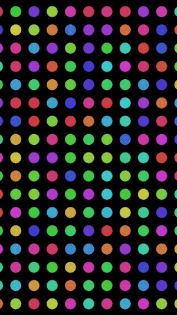
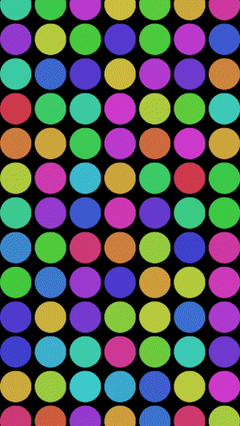

# RippleEffectView
Not only Uber-like animated loading screen.

[](https://developer.apple.com/swift/)
[](http://twitter.com/alsedi)

RippleEffectView inspired by RayWenderlich.com article [How To Create an Uber Splash Screen](https://www.raywenderlich.com/133224/how-to-create-an-uber-splash-screen)

## How it may look like



## Requirements
- Swift 2.2
- iOS 9.3+
- Xcode 7.3

#Installation
Copy `RippleEffectView.swift`to your project. Copy file if needed.

#Usage
Add new RippleEffectView, assign tile image and call startAnimating()

## How to create
### Programatically 
``` swift
let rippleEffectView = RippleEffectView()
rippleEffectView.image = UIImage(imageNamed: "someImage") 
rippleEffectView.animationDuration = 4
rippleEffectView.magnitude = 0.3
view.addSubview(rippleEffectView)
rippleEffectView.startAnimating()
```

### Storyboard and XIB
1. Drap and drop a new UIView
2. Set the class of the UIView to RippleEffectView
Due to some issues with XCode 8 and IB I desided to not expose any properties to IB. 

## Configurable properties
NB! RippleEffectView initialize itself with parent view bounds automatically, so you do not need to set it manually. If you need to use it in limited view, then use auxiliary view, e.g.

Animation uses `transform`, `scale` and `opacity`. 
```
TopView
+- ContainerView
  +- RippleEffectView
     +- CALayer with animation
```

```
All regular UIView and layer properties.
```
1. `tileImage` UIImage that will displayed in every title. RippleEffectView uses size of image to calculate grid size. No default value.
2. `animationDuraton`. Default `3.5`
3. `magnitude` force that will be applied to every circle to create ripple effect. Uber-like effect is about `0.1` - `0.2`. GIF example `-0.8`

##Read-only properties
1. `rows` rows count
2. `columns` columns count

## Methods
`stopAnimating` Start ripple animation
`startAnimating` Stop all animations

### Manual control of the grid.
You need this if you change `tileImageRandomizationClosure` when animation did start. When you call `renderGrid` to recreate all items.
If you want just remove all items (e.g. memory warning) then call `removeGrid`

## Callbacks
Tile image randomization.

You may setup image for each grid view individually, or customize one that assigned in `tileImage`. (See example for full code)
``` swift
var tileImageRandomizationClosure: RandomizationClosure? = (Int, Int, UIImage)->(UIImage)
```
This closure returns Row and Column count and tileImage for a tile.
``` swift
rippleEffectView.tileImageRandomizationClosure = { image in
  let newImage = image.imageWithRenderingMode(UIImageRenderingMode.AlwaysTemplate)
  UIGraphicsBeginImageContextWithOptions(image.size, false, newImage.scale)
  UIColor.random.set()
  newImage.drawInRect(CGRectMake(0, 0, image.size.width, newImage.size.height));
  if let titledImage = UIGraphicsGetImageFromCurrentImageContext() {
    UIGraphicsEndImageContext()
    return titledImage
  }
  UIGraphicsEndImageContext()
  return image
}
```

Animation Finished
``` swift
rippleEffectView.animationDidStop = { _ in 
  // do something
}
```
In fact, animation itself is infinite. If you need to create smooth experience on loading screens then you do not want to stop it in the middle. 
